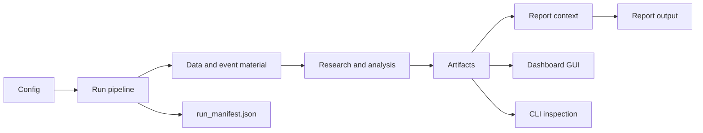

# Halpha

**Market research pipeline with Dashboard GUI and CLI.**

Halpha can be operated through a browser interface or terminal commands.

## Overview

| Entry | Use it for |
|---|---|
| Dashboard GUI | Start, inspect, and operate Halpha from a browser interface. |
| CLI | Run pipelines, validate outputs, inspect data, rerun stages, and script workflows from the terminal. |

A run writes artifacts and `run_manifest.json` under `runs/`.

## Workflow



## Install

```bash
python -m pip install -e ".[dev]"
```

Python 3.11 or newer is required.

## Dashboard GUI

Start the browser interface:

```bash
python -m halpha dashboard
```

Or start with an explicit config:

```bash
python -m halpha dashboard --config config.example.yaml
```

Common commands:

```bash
python -m halpha dashboard status
python -m halpha dashboard stop
python -m halpha dashboard restart
```

## CLI

Run without final report generation:

```bash
python -m halpha run --config config.example.yaml --no-codex
```

Validate the latest product state:

```bash
python -m halpha validate --config config.example.yaml
```

Run the full pipeline:

```bash
python -m halpha run --config config.example.yaml
```

Full runs may require configured input sources and report-generation commands.

Recommended first check:

```text
install
-> run with --no-codex
-> validate
-> inspect through Dashboard GUI or CLI
```

## Outputs

Runs are written under `runs/`.

Check run status first:

```bash
cat runs/<run_id>/run_manifest.json
```

Typical output areas:

```text
runs/<run_id>/
├── raw/
├── analysis/
├── codex_context/
├── report/
└── run_manifest.json
```

Not every run produces every file. Outputs depend on configuration, enabled stages, available inputs, and whether report generation is included.

## Common CLI operations

```bash
# Stop after a named stage
python -m halpha run --config config.example.yaml --until build_materials

# Rerun a stage from an existing run
python -m halpha stage build_materials --config config.example.yaml --run-dir runs/<run_id>

# Validate a selected run
python -m halpha validate --config config.example.yaml --run-dir runs/<run_id>

# Inspect data state
python -m halpha data inspect --config config.example.yaml
```

## Configuration

Use the example configuration for the first run:

```bash
python -m halpha run --config config.example.yaml --no-codex
```

For a private config, copy it first:

```bash
cp config.example.yaml config.local.yaml
python -m halpha run --config config.local.yaml --no-codex
```

## License

MIT.
