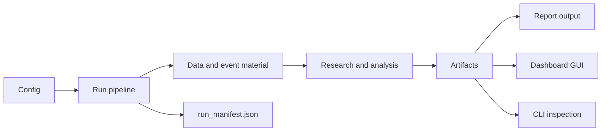

<div align="center">

# Halpha

**Market research pipeline and local dashboard.**

Run research workflows, inspect artifacts, review reports, and operate the system through Dashboard GUI or CLI.


</div>

---

## Overview

Halpha is a market research system with two main entry points:

| Entry | Use it for |
|---|---|
| Dashboard GUI | Start, inspect, and operate Halpha from a browser interface. |
| CLI | Run pipelines, validate outputs, inspect data, rerun stages, and script workflows from the terminal. |

A run produces source records, analysis artifacts, report context, report output, and a manifest under `runs/`.

## Workflow



## Install

```bash
python -m pip install -e ".[dev]"
```

Python 3.11 or newer is required.

Optional NLP dependencies are only needed when preparing or running local text-intelligence models:

```bash
python -m pip install -e ".[dev,nlp]"
```

## Start with Dashboard GUI

Start the browser interface:

```bash
python -m halpha dashboard --config config.example.yaml
```

Open the URL printed in the terminal.

Use the Dashboard GUI to inspect and operate:

- run history;
- report previews;
- artifact status;
- data state;
- strategy outputs;
- monitor state;
- command jobs;
- workbench views.

Common Dashboard commands:

```bash
python -m halpha dashboard --config config.example.yaml
python -m halpha dashboard status
python -m halpha dashboard stop
python -m halpha dashboard restart
```

## Start with CLI

Run the pipeline without final report generation:

```bash
python -m halpha run --config config.example.yaml --no-codex
```

Validate the latest product state:

```bash
python -m halpha validate --config config.example.yaml
```

Open the Dashboard GUI after the run if you want to inspect the result visually:

```bash
python -m halpha dashboard --config config.example.yaml
```

Recommended first check:

```text
install
-> run with --no-codex
-> validate
-> inspect through Dashboard GUI or CLI
```

## Full report run

Run the full pipeline:

```bash
python -m halpha run --config config.example.yaml
```

The example configuration uses Codex CLI for the final report step. Make sure the configured command is available on `PATH` and authenticated outside this repository.

## Output location

Runs are written under `runs/`.

Typical run structure:

```text
runs/<run_id>/
├── raw/
│   ├── market.json
│   ├── text_events.json
│   └── market_data_views.json
├── analysis/
│   ├── quant_strategy_runs.json
│   ├── market_signals.json
│   ├── market_regime_assessment.json
│   ├── risk_assessment.json
│   ├── decision_recommendations.json
│   ├── watch_triggers.json
│   └── intelligence_fusion.json
├── codex_context/
│   ├── context.md
│   └── prompt.md
├── report/
│   └── report.md
└── run_manifest.json
```

Not every run produces every file. Outputs depend on configuration, enabled stages, available inputs, and whether report generation is included.

`run_manifest.json` is the first file to inspect when checking run status.

## CLI operations

### Pipeline

```bash
# Full run
python -m halpha run --config config.example.yaml

# Skip final report generation
python -m halpha run --config config.example.yaml --no-codex

# Stop after a named stage
python -m halpha run --config config.example.yaml --until build_materials

# Rerun a stage from an existing run
python -m halpha stage build_materials --config config.example.yaml --run-dir runs/<run_id>
```

### Validation and inspection

```bash
python -m halpha validate --config config.example.yaml
python -m halpha data inspect --config config.example.yaml
python -m halpha workbench inspect --config config.example.yaml
```

### Monitor

```bash
# Check monitor configuration
python -m halpha monitor run --config config.example.yaml --dry-run

# Run one bounded monitor cycle
python -m halpha monitor run --config config.example.yaml --once

# Manage monitor service
python -m halpha monitor start --config config.example.yaml
python -m halpha monitor status --config config.example.yaml
python -m halpha monitor stop --config config.example.yaml
python -m halpha monitor restart --config config.example.yaml
```

### Schedule

```bash
python -m halpha schedule --config config.example.yaml
python -m halpha schedule status --config config.example.yaml
python -m halpha schedule stop --config config.example.yaml
python -m halpha schedule restart --config config.example.yaml
```

### Data

```bash
# Inspect data state
python -m halpha data inspect --config config.example.yaml

# Plan collection without applying changes
python -m halpha data collect \
  --config config.example.yaml \
  --data-type ohlcv \
  --source binance \
  --symbol BTCUSDT \
  --timeframe 1d \
  --start 2026-06-01T00:00:00Z \
  --end 2026-06-03T00:00:00Z \
  --dry-run

# Export bounded data
python -m halpha data export \
  --config config.example.yaml \
  --data-type ohlcv \
  --source binance \
  --symbol BTCUSDT \
  --timeframe 1d \
  --start 2026-06-01T00:00:00Z \
  --end 2026-06-03T00:00:00Z \
  --as-of 2026-06-03T00:00:00Z \
  --format csv \
  --output exports/ohlcv.csv
```

### Strategy research

```bash
# Run one strategy backtest
python -m halpha backtest \
  --config config.example.yaml \
  --strategy tsmom_vol_scaled \
  --symbol BTCUSDT \
  --timeframe 1d

# Run configured strategy experiments
python -m halpha experiment --config config.example.yaml
```

### Workbench

```bash
python -m halpha workbench build --config config.example.yaml
python -m halpha workbench inspect --config config.example.yaml
```

## Configuration

Use the example configuration for the first run:

```bash
python -m halpha run --config config.example.yaml --no-codex
```

For local changes, copy it first:

```bash
cp config.example.yaml config.local.yaml
python -m halpha run --config config.local.yaml --no-codex
```

## Troubleshooting

### Check run status

```bash
cat runs/<run_id>/run_manifest.json
```

### Separate pipeline issues from report-generation issues

```bash
python -m halpha run --config config.example.yaml --no-codex
```

### Validate outputs

```bash
python -m halpha validate --config config.example.yaml
```

### Inspect data state

```bash
python -m halpha data inspect --config config.example.yaml
```

### Check Dashboard GUI status

```bash
python -m halpha dashboard status
```

## License

MIT.
